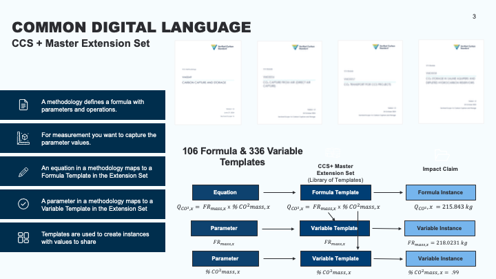

# Verra CCS+ DMRV Master Master Extension Set Library

## [Disclaimer](./DISCLAIMER)

A library of assets that are composed into an IWA MRV Master Extension Set for Verra CCS+ modules is intended to be used with Microsoft [Environmental Credit Service](https://www.microsoft.com/en-us/sustainability/environmental-credit-service) or any other platform that is based on the [Digital MRV Framework](https://interworkalliance.github.io/TokenTaxonomyFramework/dmrv/spec/v4/index.html).

## Overview

This library contains the MRV Extensions that are derived from the Verra CCS+ set of modules being governed and credits issued by [Verra](https://verra.org/methodologies/methodology-for-carbon-capture-and-storage/). The library is intended to be used with the [Digital MRV Framework](https://interworkalliance.github.io/TokenTaxonomyFramework/dmrv/spec/v4/index.html) and the [Environmental Credit Service](https://www.microsoft.com/en-us/sustainability/environmental-credit-service) to issue and manage carbon credits based on the Verra CCS+ methodology.

The Master Extension Set is installed on your platform or implementation that provides the template for creating Extension Sets that are configured and isolated for each project following the Verra CCS+ VM0049 methodology. For example, after installing the Master Extension Set on ECS or other implementation, you can create project-specific Extension Set from the master that includes only the modules your project will follow and then customize each Formula, Variable, Entity Extension and Message Pair template for your project's specific needs. Meaning, for variables that have a unit of measurement with multiple choices, i.e. `m3 or kg or GJ`, you can select the appropriate unit for your project, like `GJ`.

This allows for many Extension Sets to be created from a single Master Extension Set, each tailored to the specific needs and configurations of individual projects, like a Direct Air Capture (DAC) vs. Bio-Energy (BECCS) project.

The VM0049 methodology defines equations and parameters, which are represented as formulas and variables in the extension set templates. This is partly to be able to distinguish between an equation that is in a PDF document and its structured representation in the digital extension set, ensuring clarity and consistency in the implementation of the methodology.

The library contains:

- A [Master Extension Set](./src/Verra.Ccs.Plus.MasterExtensionSet) that is a collection of templates that register the known data types that are used between the parties, organized in the Master Extension Set into Modules (VMD0056 - VMD0062), that are used on the ECS Ledger to extend existing entities in ECS (Activity Impact Module, Impact Claim, etc.) or submitted in Claims Process for:
  - Entity Extensions - templates for extending existing entities in ECS, like Activity Impact Module, Impact Claim, etc.
  - Formula - templates for defining the formulas used in calculations required by the methodology.
  - Variables - templates for defining variables used in formulas and reports.
  - Message Pairs - templates for defining message pairs used in communication between parties and define workflow interactions.
- [Deployment samples](./src/DeploymentSamples) for installing and configuring the implementation for your environment or platform of choice.

## Content Details

The content of this repository is organized into several key components, each serving a specific purpose in the implementation and usage of the Verra CCS+ Master Extension Set.

- [Verra.Ccs.Plus.MasterExtensionSet](./src/Verra.Ccs.Plus.MasterExtensionSet) contains the Master Extension Set structure and template definitions via Json, user defined types are found in [protos](./src/Verra.Ccs.Plus.MasterExtensionSet/Protos/). The protos get compiled into both [C#](./src/Verra.Ccs.Plus.MasterExtensionSet/CcsPlusExtensionSetLibrary.cs) and [JavaScript/Typescript](./src/models/ts/) libraries to be used as data contained within template instances.
- [models](./src/models) contains the compiled models for other platforms, currently Javascript and Typescript are supported, please use Issues to request other platforms you need like Java, Go, etc.
- [Deployment samples](./src/DeploymentSamples) for installing and configuring the implementation for your environment or platform of choice.

## Dependencies

The Master Extension Set itself is defined using Json templates and user-defined types specified in protobufs, which are then compiled into various platform-specific libraries for use in template instances.

Deployment tools can be found in the [ECSSDK - ADD NEW PATH HERE](https://github.com/marleygoxy/ecssdk) to be cloned.

The model types for other platforms can be found in [models](./src/models/), currently Javascript and TypeScript are support, please use Issues to request other platforms you need like Java, Go, etc.

## Documentation

Documentation starts with the [dMRV Framework](https://interworkalliance.github.io/TokenTaxonomyFramework/dmrv/spec/v4/index.html), which provides the foundational concepts and specifications for implementing digital MRV (Measurement, Reporting, and Verification) systems.

- **[Deployment Samples](./src/DeploymentSamples/readme.md)** - Deployment guide and basic usage using ECS as an example environment.

### Verra CCS+ Modules

[VM0049 Methodology](https://verra.org/methodologies/methodology-for-carbon-capture-and-storage/)

- **VM0049 Carbon Capture Module**
- **VMD0056 Direct Air Capture (DAC) Module**
- **VMD0057 Transport Module**
- **VMD0058 Storage Modules**
- **VMD0059 Bioenergy with CCS (BECCS) Module**
- **VMD0062 CO2 Capture FROM Natural Gas Processing Module**
- **VT0012 Accounting Non-VCS CO2 in CCS Projects**
- **VT0013 Differentiating Reductions and Removals in CCS Projects, v1.0**

## Requirements

- .NET 10.0 or later
- Microsoft Environmental Credit Service access,contact [EarthXCG](https://www.earthxcg.com)
- [ECS SDK](https://github.com/earthxcg-oxy/ecssdk)

## License

This project is licensed under the Apache 2.0 License - see the [LICENSE](LICENSE) file for details.

## Related Projects

- [Microsoft Environmental Credit Service](https://www.microsoft.com/en-us/sustainability/environmental-credit-service)
- [Digital MRV Framework](https://interworkalliance.github.io/TokenTaxonomyFramework/dmrv/spec/v3/index.html)
- [Verra Verra CCS+ Methodology](https://verra.org/methodologies/methodology-for-carbon-capture-and-storage/)
- [EcsSdk](https://github.com/earthxcg-oxy/ecssdk)
